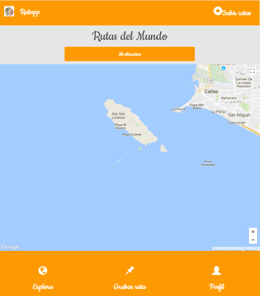

# HERE MAPS

## Objetivo
Crear una plataforma que permita a los usuarios trackear y monitorear recorridos que se realice en senderos al aire libre/outdoor, orientada a los amantes de las actividades de aventura (montañas, lagos, parques, etc.) en Perú.

### Integrantes:
- Lilliam Haro
- Melissa Yauri

## Flujo

1. La plataforma brinda el mapa del api de Google Maps.

     

2. El primer requisito que cumple la platforma es que brinda tu ubicación al dar click al botón mi ubicación.

 
